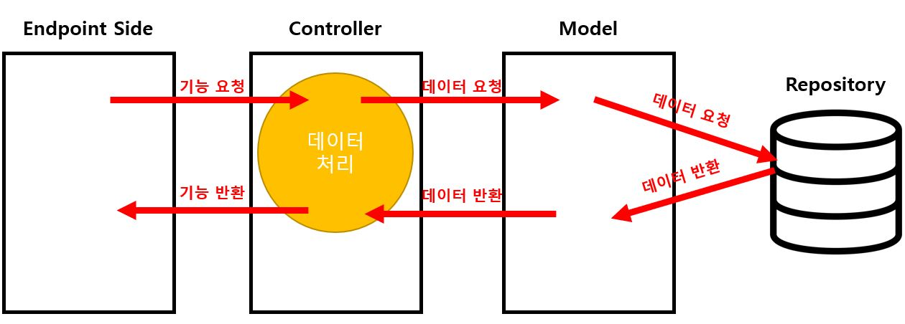

# ATM Controller 사용방법
과제에서의 Sample Code는 ATM\app.py에 명시되어있습니다.

## 1. 의존성 분리
> 프로젝트 구현에 앞서 Endpoint Side, Controller, Model 간의 의존성을 분리하기 위해 다음과 같은 구조로 ATM Controller을 설계했습니다.
- <b>Endpoint Side</b> : 필요한 기능을 Controller에 요청합니다.

- <b>Controller</b> : Endpoint Side와 Model 사이에서 기능을 수행합니다.<br>
주로 Endpoint Side에서의 요청을 수행하고 반환하며,<br>
요청이 Model과 관련된 것이라면 Model에 기능을 요청합니다.

- <b>Model</b> : 데이터 저장소와 관련된 역할을 수행합니다.



- 또한 controller, model, DTO의 \_\_init\_\_.py에 추상클래스를 정의함으로써 유연하게 대응할 수 있도록 구현했습니다.

## 2. Controller 기능
구현한 Controller에서는 다음과 같은 기능을 수행합니다.
- 핀번호 포맷 정규식 설정
- 핀번호 포맷 검증
- 계정 등록
- 핀번호에 해당하는 계정 반환
- 계정에 해당하는 계정 반환
- 입금
- 출금
- 잔고 조회

### 핀번호 포맷 정규식 설정 (set_pin_regex)
- 핀번호 포맷(dict형)을 입력받아 핀번호 포맷을 설정합니다.

- 각 입력값에 대한 Type, Key 검증을 수행합니다.

- 검증이 완료되면, 정규식에 사용될 패턴을 설정합니다.
``` python
from controller.AtmController import AtmController
from model.AtmModel import AtmModel
controller = AtmController(AtmModel())
controller.set_pin_regex(
    {'numbers':[2,4,1], # numbers는 split문자 사이의 숫자의 길이를 뜻합니다.
    # [2, 4, 1]의 경우 XX-XXXX-X의 형식으로 설정됩니다.
    'split':'-' # split은 구분되는 문자를 뜻합니다.
    })
print(controller.pin_regex) # [0-9]{2}-[0-9]{4}-[0-9]{1}
```

### 핀번호 포맷 검증 (validate_pin_number_format)
- 핀번호를 입력받아 설정된 핀번호 포맷에 일치하는지 확인합니다.

- 입력받은 핀번호의 Type을 확인하고, 핀번호 정규식이 설정되어 있는지 확인합니다.

- 검증이 완료되면, 설정된 포맷에 일치하는지 확인합니다.

- 포맷이 일치하면 True, 일치하지 않으면 False를 반환합니다.
``` python
from controller.AtmController import AtmController
from model.AtmModel import AtmModel
controller = AtmController(AtmModel())
# XX-XXXX-X 포맷으로 설정합니다.
controller.set_pin_regex({'numbers':[2,4,1], 'split':'-'}) 
print(controller.validate_pin_number_format('11-2222-3')) # 포맷에 일치하므로 True가 반환됩니다.
print(controller.validate_pin_number_format('1-12222-3')) # 포맷에 일치하지 않으므로 False가 반환됩니다.
print(controller.validate_pin_number_format('10-1223-7')) # 포맷에 일치하므로 True가 반환됩니다.
```

### 계정 등록 (register_account)
- 핀번호, 계정이름, 잔액을 입력받아 계정을 등록합니다.
- 각 입력값에 대한 Type, Value 검증을 수행합니다.
- 검증이 완료되면 입력한 계정이 중복이 되는지 확인합니다.
- 이후 Model을 통해 저장소에 데이터를 DTO 객체로 저장합니다.
- cf) 계정을 등록하기 전, '핀번호 포맷 정규식 설정'기능이 먼저 실행되어야합니다.
``` python
from controller.AtmController import AtmController
from model.AtmModel import AtmModel
from config import Config
controller = AtmController(AtmModel())
controller.set_pin_regex({'numbers':[3,3,6], 'split':'-'})
controller.register_account('111-222-333333', 'Test', 100000)
```

### 핀번호에 해당하는 계정 반환 (get_account_by_validate_pin_number)
- 핀번호를 입력받아 핀번호에 해당하는 계정을 반환합니다.
- 이때 반환되는 계정은 복수의 계정일 수 있습니다.
``` python
from controller.AtmController import AtmController
from model.AtmModel import AtmModel
controller = AtmController(AtmModel())
controller.set_pin_regex({'numbers':[3,3,6], 'split':'-'})
controller.register_account('111-222-333333', 'SONGYONGWOOK', 10000)
controller.register_account('111-222-333333', 'SONGYONGWOOK2', 2000000)
controller.register_account('111-222-333333', 'SONGYONGWOOK3', 310000)
controller.register_account('000-111-222222', 'PARKSUNGHOON', 770000)
controller.register_account('123-456-333333', 'JUNGJINCHAN', 11000000)
print('\n'.join(list(map(lambda x:str(x.__dict__), 
controller.get_account_by_validate_pin_number('111-222-333333')))))
'''
{'_Account__pin_number': '111-222-333333', '_Account__account': 'SONGYONGWOOK', '_Account__balance': 10000}
{'_Account__pin_number': '111-222-333333', '_Account__account': 'SONGYONGWOOK2', '_Account__balance': 2000000}
{'_Account__pin_number': '111-222-333333', '_Account__account': 'SONGYONGWOOK3', '_Account__balance': 310000}
'''
```

### 계정에 해당하는 계정 반환 (find_account)
- 입력한 계정에 대한 데이터를 가져오는 기능입니다.
- 데이터가 잘 저장되었는지 확인하기 위한 기능입니다.
``` python
from controller.AtmController import AtmController
from model.AtmModel import AtmModel
controller = AtmController(AtmModel())
controller.set_pin_regex({'numbers':[3,3,6], 'split':'-'})
controller.register_account('111-222-333333', 'SONGYONGWOOK', 10000)
controller.register_account('111-222-333333', 'SONGYONGWOOK2', 2000000)
controller.register_account('111-222-333333', 'SONGYONGWOOK3', 310000)
controller.register_account('000-111-222222', 'PARKSUNGHOON', 770000)
controller.register_account('123-456-333333', 'JUNGJINCHAN', 11000000)

# 핀번호에 대한 계정을 받습니다.
accounts = controller.get_account_by_validate_pin_number('111-222-333333')

# 사용자가 계정을 선택하면 모델로부터 계정 하나만을 반환합니다.
sel_account = accounts[1]
print(controller.find_account(sel_account).__dict__)
```

### 입금 (deposit)
- 계정과 입금할 금액을 입력받아 기능을 수행합니다.
- 입력값에 대한 Type, Value 검증을 수행합니다.
- 입금 계산 이후, Model을 통해 데이터를 업데이트합니다.
``` python
from controller.AtmController import AtmController
from model.AtmModel import AtmModel
controller = AtmController(AtmModel())
controller.set_pin_regex({'numbers':[3,3,6], 'split':'-'})
controller.register_account('111-222-333333', 'SONGYONGWOOK', 10000)
controller.register_account('111-222-333333', 'SONGYONGWOOK2', 2000000)
controller.register_account('111-222-333333', 'SONGYONGWOOK3', 310000)
controller.register_account('000-111-222222', 'PARKSUNGHOON', 770000)
controller.register_account('123-456-333333', 'JUNGJINCHAN', 11000000)

# 핀번호에 대한 계정을 받습니다.
accounts = controller.get_account_by_validate_pin_number('111-222-333333')

# 사용자가 계정을 선택하면 모델로부터 계정 하나만을 반환합니다.
sel_account = accounts[1]

# 선택한 계정에 10000원을 입금합니다.
controller.deposit(sel_account, 10000)
```

### 출금 (withdraw)
- 계정과 출금할 금액을 입력받아 기능을 수행합니다.
- 입력값에 대한 Type, Value 검증을 수행합니다.
- 출금 계산 이후, Model을 통해 데이터를 업데이트합니다.
``` python
from controller.AtmController import AtmController
from model.AtmModel import AtmModel
controller = AtmController(AtmModel())
controller.set_pin_regex({'numbers':[3,3,6], 'split':'-'})
controller.register_account('111-222-333333', 'SONGYONGWOOK', 10000)
controller.register_account('111-222-333333', 'SONGYONGWOOK2', 2000000)
controller.register_account('111-222-333333', 'SONGYONGWOOK3', 310000)
controller.register_account('000-111-222222', 'PARKSUNGHOON', 770000)
controller.register_account('123-456-333333', 'JUNGJINCHAN', 11000000)

# 핀번호에 대한 계정을 받습니다.
accounts = controller.get_account_by_validate_pin_number('111-222-333333')

# 사용자가 계정을 선택하면 모델로부터 계정 하나만을 반환합니다.
sel_account = accounts[1]

# 선택한 계정에 10000원을 출금합니다.
controller.withdraw(sel_account, 10000)

# 만약 잔액이 부족할 경우 '잔액이 부족합니다' 에러메시지를 반환합니다.
print(controller.withdraw(sel_account, 10000000))
```

### 잔액 조회 (get_balance)
- 계정을 입력받아 계정의 잔액을 반환합니다.
- 입력한 값의 Type을 검증합니다.
- 검증 이후, 계정의 잔액을 반환합니다.
``` python
from controller.AtmController import AtmController
from model.AtmModel import AtmModel
controller = AtmController(AtmModel())
controller.set_pin_regex({'numbers':[3,3,6], 'split':'-'})
controller.register_account('111-222-333333', 'SONGYONGWOOK', 10000)
controller.register_account('111-222-333333', 'SONGYONGWOOK2', 2000000)
controller.register_account('111-222-333333', 'SONGYONGWOOK3', 310000)
controller.register_account('000-111-222222', 'PARKSUNGHOON', 770000)
controller.register_account('123-456-333333', 'JUNGJINCHAN', 11000000)

# 핀번호에 대한 계정을 받습니다.
accounts = controller.get_account_by_validate_pin_number('111-222-333333')

# 사용자가 계정을 선택하면 모델로부터 계정 하나만을 반환합니다.
sel_account = accounts[1]

# 선택한 계정의 잔액을 반환합니다.
print(controller.get_balance(sel_account))
```

## 3. Model 기능
구현한 Model에서는 다음과 같은 기능을 수행합니다.
- 계정 데이터 저장
- 핀번호에 해당하는 데이터 반환
- 계정에 대한 계정 데이터 반환
- 계정의 잔액 변경 및 저장

### 계정 데이터 저장 (save_account)
- 핀번호, 계정 이름, 잔액을 입력받아 계정을 생성하고 저장소에 저장합니다.
- 이때 입력값들은 controller에 의해 검증되었다고 가정합니다.
``` python
from model.AtmModel import AtmModel
model = AtmModel()
'''
핀번호 : '111-222-333333'
계정 이름 : 'test'
잔액 : 100
의 데이터를 저장소에 저장합니다.
'''
model.save_account('111-222-333333', 'test', 100)
# model 리포지토리에 저장된 데이터를 출력합니다.
print('\n'.join(map(lambda x:str(x.__dict__), model.repository)))
```

### 핀번호에 해당하는 데이터 반환 (find_by_pin_num)
- 핀번호를 입력받아 핀번호에 해당하는 계정들을 반환합니다.
- 이때 반환되는 계정은 복수일 수 있습니다.
``` python
from model.AtmModel import AtmModel
model = AtmModel()
model.save_account('111-222-333333', 'test', 100)
model.save_account('111-222-333333', 'test1', 2100)
model.save_account('111-222-333333', 'test2', 100100)

# 111-222-333333 에 해당하는 계정들을 반환합니다.
accounts = model.find_by_pin_num('111-222-333333')
for account in accounts:
    print(account.__dict__)
```

### 계정에 대한 계정 데이터 반환 (find_by_account)
- 계정에 해당하는 데이터 객체를 반환합니다.
- 만약 찾는 계정이 없을 경우 KeyError를 발생시킵니다.
``` python
from model.AtmModel import AtmModel
model = AtmModel()
model.save_account('111-222-333333', 'test', 100)
model.save_account('111-222-333333', 'test1', 2100)
# 찾을 계정
find_account = model.save_account('111-222-333333', 'test2', 100100)

# 저장소에서 찾을 계정을 찾습니다.
result = model.find_by_account(find_account)

print('찾을 계정과 찾은 계정을 비교합니다.', find_account == result)
```

### 계정의 잔액 변경 및 저장 (update_balance_by_account)
- 수정할 계정과 잔액을 받아 데이터를 업데이트합니다.
- 이때 들어온 계정은 위의 find_by_account로 검증되며, balance는 controller에 의해 검증됩니다.
``` python
from model.AtmModel import AtmModel
model = AtmModel()
model.save_account('111-222-333333', 'test', 100)
model.save_account('111-222-333333', 'test1', 2100)
# 잔액을 변경할 계정
find_account = model.save_account('111-222-333333', 'test2', 100100)

# 0원으로 잔액 변경
model.update_balance_by_account(find_account, 0)

# 계정이 변경되었는지 확인
find_account = model.find_by_account(find_account)
print(find_account.balance)
```

## 4. 테스트
unittest 모듈을 사용하여 테스트를 수행합니다.

## AtmController 테스트
- AtmController의 메소드들을 테스트합니다.
- 각 테스트는 잘못된 데이터 입력에 대해 Type, Value Error를 일으키는지 확인하며 기능을 제대로 수행했는지 확인합니다.
- test\AtmControllerTest.py를 실행시켜 테스트를 할 수 있습니다.

### test_validate_pin_number_format
- 핀번호 검증 메소드를 테스트합니다.
- 테스트에서는 XXX-XXX-XXXXXX의 핀번호 포맷을 설정했으나 <br>100개의 테스트 케이스는 XX-XXX-XXXX의 포맷을 갖기에 모두 일치하지 않습니다. <br> 따라서 모두 False를 반환하는지 확인합니다.

### test_register_account
- 계정 등록 메소드를 테스트합니다.
- 1 : 입력값에 대한 검증을 수행했는지 테스트합니다.
- 2 : 핀번호의 포맷이 일치하는지 테스트합니다.
- 3 : 중복된 계정일 때 에러가 발생하는지 확인합니다.
- 4 : 계정이 등록되었는지 확인합니다.

### test_set_pin_regex
- 핀번호 포맷 정규식 설정 메소드를 테스트합니다.
- 1 : 입력값에 대한 검증을 수행했는지 테스트합니다.
- 2 : 핀포맷이 제대로 설정되었는지 테스트합니다.

### test_validate_pin_number_format
- 핀번호 포맷 검증 메소드를 테스트합니다.
- 1 : 입력값에 대한 검증을 수행했는지 테스트합니다.
- 2 : 핀포맷이 설정되었는지 테스트합니다.

### test_deposit
- 입금 메소드를 테스트합니다.
- 1 : 입력값에 대한 검증을 수행했는지 테스트합니다.
- 2 : 임의의 100개의 테스트를 통과하는지 테스트합니다.

### test_withdraw
- 출금 메소드를 테스트합니다.
- 1 : 입력값에 대한 검증을 수행했는지 테스트합니다.
- 2 : 잔액이 부족할 경우 '잔액이 부족합니다' 문자열을 반환하는지 테스트합니다.
- 3 : 임의의 100개의 테스트를 통과하는지 테스트합니다.

### test_get_balance
- 잔액 반환 메소드를 테스트합니다.
- 1 : 입력값에 대한 검증을 수행했는지 테스트합니다.

## AtmModel 테스트
- AtmModel의 메소드들을 테스트합니다.
- Model에 전달되는 값들은 Controller에서 검증되었다고 가정합니다.
- 각 테스트는 기능을 제대로 수행했는지 확인합니다.
- test\AtmModelTest.py를 실행시켜 테스트를 할 수 있습니다.

### test_save_account
- 계정 등록 메소드를 테스트합니다.
- 테스트 계정에 대한 정보가 주어졌을 때, 저장소에 저장이 되는지 확인합니다.

### test_find_by_pin_num
- 핀번호로 계정을 찾는 메소드를 테스트합니다.

### test_find_by_account
- 전달된 계정을 반환하는 메소드를 테스트합니다.
- 저장소에 없는 계정을 찾을 경우 KeyError를 발생시키는지 확인합니다.
- 데이터를 제대로 가져오는지 확인합니다.

### test_update_balance_by_account
- 잔액을 업데이트하는 메소드를 테스트합니다.